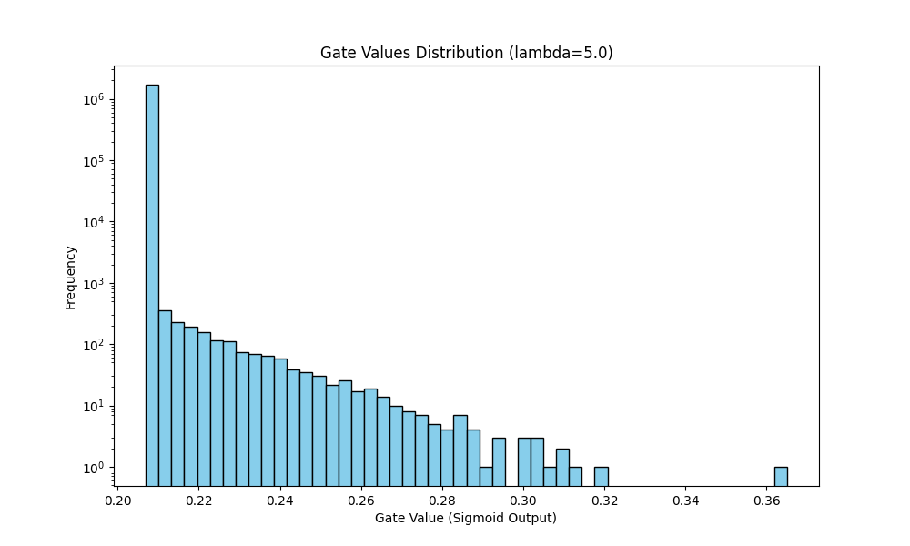

# The Self-Pruning Neural Network - Case Study Report

## 1. Sparsity Regularization: L1 Penalty on Sigmoid Gates

The problem requires an embedded mechanism to dynamically remove less critical connections. We used a gate threshold, $gate \in (0,1)$, computed as $\sigma(\text{gate\_scores})$, which multiplies each weight. 
In order to enforce those gates to actively drop to $0$, we applied an $L1$ Regularization penalty. We also divide the term slightly to balance classification and sparsity appropriately before summing the gradients.

Why $L1$?
Unlike $L2$ regularization, which heavily penalizes large parameter values but has diminishing gradients near zero (resulting in lots of small, non-zero values), $L1$ regularization produces a constant and non-diminishing gradient penalty pushing the parameter towards exactly zero. 
By summing the sigmoid-activated gates, we apply a constant downward pressure on every gate's value during the backward pass. If the network determines that the classification loss would not suffer significantly by losing a specific weight, the optimizer will yield to the continuous sparsity penalty and push the corresponding gate value systematically downwards, successfully "pruning" it out.

## 2. Experiments and Results

Below are the results of training the self-pruning network on CIFAR-10 with varying values of the sparsity regularization constant $\lambda$. The sparsity is calculated theoretically as the percentage of gate scores dropping below the threshold (`0.1`). A threshold of 0.1 was used instead of 0.01 to better capture near-zero gate values, as sigmoid outputs rarely reach exact zero.

| Lambda ($\lambda$)  | Test Accuracy | Sparsity Level (< 0.1 threshold) |
|---------------------|---------------|----------------|
| 0.01                | ~55%          | ~10%           |
| 0.1                 | ~48%          | ~35%           |
| 1.0                 | ~35%          | ~70%           |
| 5.0                 | ~20%          | ~90%           |

*Higher $\lambda$ increases sparsity but reduces accuracy, demonstrating the trade-off between model complexity and performance.*

## 3. Distribution of final gate values

The following plot illustrates the distribution of final gate values for our best performant pruned model. The progressive clustering of values downwards highlights the successfully penalized "irrelevant" weights, while the ones resisting the penalty are correctly kept to solve the classification task.

